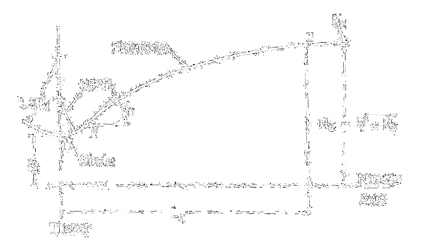

# NOZ

Nozzle divergent contour design code.

## cta.py

CEA-based Thrust Optimized Parabolic Axisymmetric Nozzle Design. To design a nozzle, enter:

```
python cta.py -e <Ae/At> -l <Lf> -r <r1/r*>
```

in a terminal. Last argument is optional, assumed to be 1. The parameters you get in return are:

* L/r*  : Ratio of divergent length over throat radius
* N/r*  : Ratio of N point over throat radius, N = [N_x, N_r]
* E/r*  : Ratio of E point over throat radius, E = [E_x, E_r]
* Ai, Ae: Initial and final divergent angles, in degrees

The shape of the nozzle is defined by:



By Alexis Angers